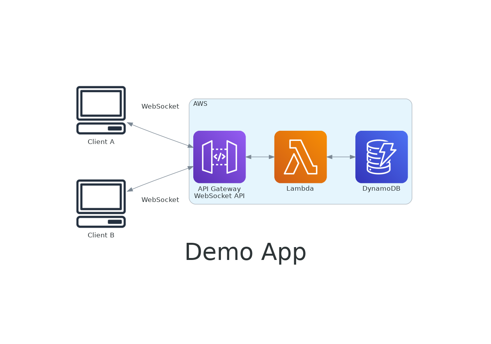
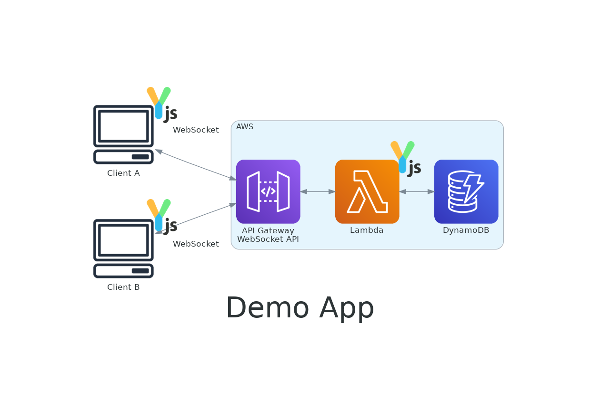
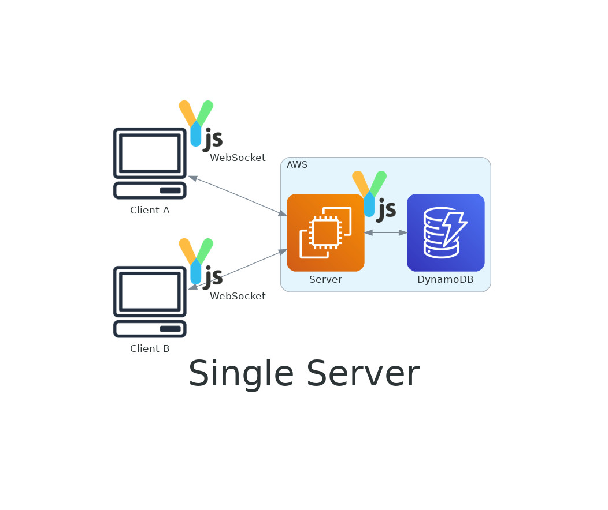

<!--
サーバーレスで構築された共同編集サービスのデモを用いて、構成例や利用したOSSなどを紹介します。
特に、共同編集データをDynamoDBに保存するOSSを実装、公開した知見をもとに、共同編集データ永続化の設計観点を、分散システム、冪等性、結果整合性、富豪的解決法などをキーワードに説明します。
-->

# サーバーレスで作る共同編集サービス

やまたつ @devio_day1
2023-04-11

---

<dev style="display: flex; justify-content: center; align-items: center; margin-top: 40px;">
  
  <ul style="list-style-type: none; line-height: 1.4">
    <li style="font-size: 56px; font-weight: 700;">山本達也（やまたつ）</li>
    <li style="font-size: 32px; margin-bottom: 0px;">クラスメソッド株式会社</li>
    <li style="font-size: 32px; margin-bottom: 16px;">CX事業本部 デリバリー部</li>
    <li style="font-size: 24px; margin-bottom: 0px;">
      <a href="https://twitter.com/yamatatsu193">Twitter: @yamatatsu193</a>
    </li>
    <li style="font-size: 24px; margin-bottom: 16px;">
      <a href="https://github.com/yamatatsu">GitHub: @yamatatsu</a>
    </li>
    <li style="font-size: 32px; margin-bottom: 8px;">
      コミュニティ活動:
      <ul style="list-style-type: disc">
        <li style="font-size: 24px;">JAWS-UG CDK支部</li>
      </ul>
    </li>
    <li style="font-size: 32px; margin-bottom: 8px;">
      OSSコントリビューション:
      <ul style="list-style-type: disc">
        <li style="font-size: 24px;">aws-cdk</li>
      </ul>
    </li>
  </ul>
</dev>

---

### もくじ

1. イントロ
1. デモ
1. 構成および技術紹介
1. サーバーレス化の課題と解決
1. Yjsの永続化

---

## イントロ

---

<!-- _class: center -->
ある日の社内slack

---

<!-- _class: center -->
:sunglasses:「miro作るのって難しいの？」

---

<!-- _class: center -->
:triumph: 「それはそうですよ！  
websocketで状態共有して競合解決して  
undo/redoと無限平面とあとあと」

---

<!-- _class: center -->
:innocent: （でも本当はよくわからん。。。）

---

<!-- _class: center -->
:thinking:（なんかむずかしそう。。。）

---

### :thinking: 何が難しそう？

- 無限平面（WebGL）
- 共同編集 ← 今日話すのはここ

---

## デモ

---

## 構成紹介

---

<!-- transition: fade 100ms -->

---

<!-- transition: slide 300ms -->

---

## Yjs紹介

---

<!-- transition: fade 0ms -->

Yjsとは共同編集におけるデータコンフリクトを解決するためのライブラリです。

---

Yjsとは共同編集におけるデータコンフリクトを解決するためのライブラリです。CRDT(Conflict-free Replicated Data Type)というデータ構造を用いて、データの整合性を保証します。

---

Yjsとは共同編集におけるデータコンフリクトを解決するためのライブラリです。CRDT(Conflict-free Replicated Data Type)というデータ構造を用いて、データの整合性を保証します。CRDTはGoogle Docsなどで使われているOT(Operational Transformation)という手法と比較されることが多いです。OTは編集操作を順番に適用していくことで、データの整合性を保証します。そのため順序を保証する中央サーバーが必要になります。一方CRDTは編集操作を順番に適用することなく、結果整合的にデータの整合性を保証します。そのため順序を保証する中央サーバーが不要で、分散システムに適した手法です。

---

Yjsとは共同編集におけるデータコンフリクトを解決するためのライブラリです。CRDT(Conflict-free Replicated Data Type)というデータ構造を用いて、データの整合性を保証します。CRDTはGoogle Docsなどで使われているOT(Operational Transformation)という手法と比較されることが多いです。OTは編集操作を順番に適用していくことで、データの整合性を保証します。そのため順序を保証する中央サーバーが必要になります。一方CRDTは編集操作を順番に適用することなく、結果整合的にデータの整合性を保証します。そのため順序を保証する中央サーバーが不要で、分散システムに適した手法です。またOTに比べて複雑なデータ構造を管理することに向いていると言われています。YjsはJavaScriptで実装されたCRDTライブラリで、ブラウザ上で動作する共同編集サービスを構築するためのライブラリです。各ユーザーの編集操作をYjsのデータ構造に適用することで、update（更新）と呼ばれるバイナリデータが発行されます。このバイナリデータを各ユーザーが受け取ることで、たとえ同時に編集されたとしても、データの整合性を保証することができます。updateの適用は可換であり冪等なので通信上で輻輳があってもデータが破損することはありません。

---

<!-- transition: slide 300ms -->

Yjsとは共同編集におけるデータコンフリクトを解決するためのライブラリです。CRDT(Conflict-free Replicated Data Type)というデータ構造を用いて、データの整合性を保証します。CRDTはGoogle Docsなどで使われているOT(Operational Transformation)という手法と比較されることが多いです。OTは編集操作を順番に適用していくことで、データの整合性を保証します。そのため順序を保証する中央サーバーが必要になります。一方CRDTは編集操作を順番に適用することなく、結果整合的にデータの整合性を保証します。そのため順序を保証する中央サーバーが不要で、分散システムに適した手法です。またOTに比べて複雑なデータ構造を管理することに向いていると言われています。YjsはJavaScriptで実装されたCRDTライブラリで、ブラウザ上で動作する共同編集サービスを構築するためのライブラリです。各ユーザーの編集操作をYjsのデータ構造に適用することで、update（更新）と呼ばれるバイナリデータが発行されます。このバイナリデータを各ユーザーが受け取ることで、たとえ同時に編集されたとしても、データの整合性を保証することができます。updateの適用は可換であり冪等なので通信上で輻輳があってもデータが破損することはありません。共同編集で必須なundo/redo機能もサポートされており、加えてWebRTC, WebSocketなどのプロトコル、IndexedDB, LevelDBなどのストレージ、React, Vueなどのフレームワーク、monaco, CodeMirrorなどのエディターなど、さまざまな技術との組み合わせに対応しています。

---

Yjsとは

- 共同編集のライブラリ
- update（更新）を送り合うことで同期する
- 結果整合的で分散システムに向いてる
  - 冪等で可換
- JavaScriptで実装されている
- undo/redoをサポート

---

## サーバーレス化の課題と解決

---

### 課題.1
既存のy-websocket serverは  
サーバーの状態に依存している

---

---

---

### 課題.2
Amazon API Gateway WebSocket API は
path parameterをサポートしていない

---

### 課題.3
既存のy-websocket clientは  
subprotocolをサポートしていない

---

### 課題.4
既存のy-dynamodbは  
sdk v2しかサポートしてないし、遅いし、整合性の課題があるし、メンテが止まっている

---

### 課題を解決したコードがこちら

https://github.com/yamatatsu/yjs-lab/

---

### [y-dynamodb-for-sdkv3](https://github.com/yamatatsu/yjs-lab/tree/main/packages/y-dynamodb-for-sdkv3)

- sdk v3対応
- 書き込み速度が100倍向上
- flush操作の整合性が向上

---

## Yjsの永続化

---

---

---

<!-- _class: center -->
何がいけなかったのか？

---

- 整合性の解決をDBではなくComputeが担っている
- DynamoDBは悲観ロックやロック待ち書き込みをサポートしていない
- 楽観ロックはできる。なので成功するまで何度も読み出して書き込むことはできる。

---

<!-- _class: center -->

じゃあどうする？:thinking:

---

<!-- _class: center -->

整合してようがしてなかろうが書き込んでしまえばいい:bulb:

---

<!-- _class: center -->

読み込んでから整合させればいい:bulb::bulb:

---

<!-- _class: center -->

updateを全部保存してしまえばいい:bulb::bulb::bulb:

---

---

<!-- _class: center -->

データ、無限に増えていいの？:thinking:

---

<!-- _class: center -->

flushという操作があります:bulb:

---

### flush

- データ読み出し時に行う
- すべてのupdateを取り出し、Y.Docに書き込む
- 完成したY.Docのスナップショットを**他の更新と同じように保存する**
- 最後にflushされたupdateたちを削除する

---

これによりYjsは分散コンピューティング上での永続化の課題を解決できました:tada:

---

Yjsで楽して共同編集機能を作りましょう！

---

rust実装の[Yrs](https://docs.rs/yrs/latest/yrs/)もあるよ！

---

<!-- _class: center -->
ご清聴ありがとうございました :pray:
